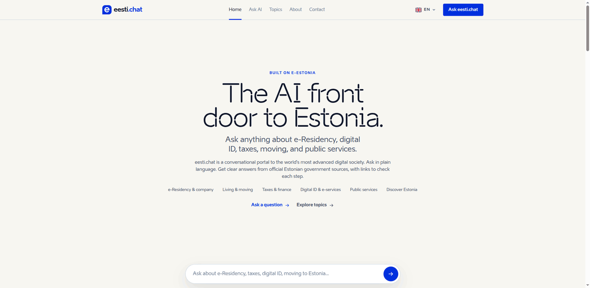

# eesti.chat

**A conversational AI portal to Estonia — the world's most advanced digital society.**



🔗 **Live:** [eesti.chat](https://eesti.chat)

eesti.chat is an AI "front door" to Estonia: ask a question in plain language about
e-Residency, starting a company, taxes, digital identity, moving to Estonia, or any
public service, and a specialist assistant answers — grounded in **official Estonian
sources** and with links so you can verify every step.

> eesti.chat is an independent project. It is **not** an official government service.

## The six specialist assistants

| Assistant | Covers | Primary official sources |
|---|---|---|
| **e-Residency & Company** | apply for e-Residency, register/run an EU company remotely | e-resident.gov.ee, rik.ee, emta.ee |
| **Living & Moving** | residence permits, visas, digital nomad visa, registering address | politsei.ee, eesti.ee |
| **Taxes & Finance** | income tax, VAT, corporate distributed-profit tax, e-Tax filing | emta.ee |
| **Digital ID & e-Services** | e-ID, Smart-ID, Mobiil-ID, digital signatures, X-Tee | ria.ee, id.ee |
| **Public Services** | health, education, benefits, voting, documents | eesti.ee, tervisekassa.ee |
| **Discover Estonia** | the e-Estonia story, culture, why Estonia (explainer) | e-estonia.com |

A router dispatches each question by prefix → keyword heuristics → LLM fallback.
Every assistant grounds factual answers with live **Exa** web search biased to official
`.ee` domains, and cites its sources.

## Stack

- **FastHTML** — server-rendered UI (white / black / Estonia-blue theme)
- **LangGraph** — multi-agent ReAct orchestration
- **xAI Grok** — LLM (configurable to OpenAI via `LLM_PROVIDER`)
- **Exa** — live web search grounding
- **PostgreSQL** — chat history, users (optional; app runs without login)
- English + Estonian content, more languages via the switcher

## Running locally

```bash
uv venv && uv pip install -r requirements.txt   # or: pip install -r requirements.txt
cp .env.example .env    # set XAI_API_KEY and EXA_API_KEY
python main.py          # serves on http://localhost:5011
```

Required environment variables (see `.env.example`):

- `XAI_API_KEY` (or `OPENAI_API_KEY` with `LLM_PROVIDER=openai`)
- `EXA_API_KEY` — for grounded web search
- `DB_URL` — optional; needed only for saved chat history and login

## Disclaimer

Answers are AI-generated from public sources and may be incomplete or out of date.
Always confirm with the official source before acting. This is not legal advice.
